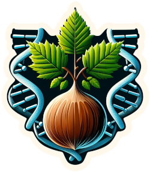

# Hazexplorer2.0 :deciduous_tree: :compass:

This is an updated version of the [HazelExplorer Pipeline](https://github.com/marcellobeltrami/Hazexplorer).



This tool aims at analysing methylation states from bisulphite sequencing data. This pipeline will take as input raw reads of Bisulphite Sequencing and output SNP calls from Bis-SNP and CGmapTools.
Tool testing was done on Hazel and Oak dataset, although changing the reference genome will allow adaptation of the  pipeline to any plant genome.


## Dependencies:

    Nextflow (version 22.04.0)
    Slurm job scheduler (optional, for HPC execution, comment out in nextflow.config file if not needed.)
    Bismark (version 0.24.2)
    FastQC (version 0.11.9)
    Fastp (version 0.23.2)
    Java (version 17.0.6)
    SAMtools (version 1.17)
    GATK (version 4.4.0.0)
    CGmapTools (version 0.1.3)

If the tools do not meet exact requirements, the pipeline might behave unexpectedly. 

## Quick-start
To run the HAZEXPLORER2.0 pipeline, follow these steps:

### Step 1:
Clone the repository:
```bash
git clone https://github.com/qishi797/oak
```

### Step 2:
Navigate to the cloned directory:
```bash
cd oak
```
### Step 3:
Install dependencies listed above if running on your local machine.
Follow the instructions [here](https://www.nextflow.io/docs/latest/getstarted.html) to install Nextflow.

### Step 4:
Execute the pipeline:
If running on your local machine:
> [!NOTE]
> Do not forget to uncomment the "process.executor = 'local' " (remove //) in the nextflow.config file. 
```bash
nextflow run main_hazex_v.2.nf --paired_reads='<path_to_paired_reads_directory>/*{1,2}.fq.gz>' --reference_genome='<path_to_reference_genome>' --reference_name='reference_name.fa' --index_requirement=<0_or_1> --parallelize=<value> --threads=<value> --results=<path_results_directory>
```

If using HPC with slurm scheduler, use the sbatch command:
> [!NOTE]
> Do not forget to uncomment the "process.executor = 'slurm' " line (remove //) in the nextflow.config file.
```bash
sbatch nextflow run main_hazex_v.2.nf --paired_reads='<path_to_paired_reads_directory>/*{1,2}.fq.gz>' --reference_genome='<path_to_reference_genome>' --reference_name='reference_name.fa' --index_requirement=<0_or_1> --parallelize=<value> --threads=<value> --results=<path_results_directory>
```

## Parameters and their meaning:

    --paired_reads=<pattern>      Required. Path to paired-end reads in FASTQ format.  Use the pattern "./   data/reads/*{1,2}.fq.gz". By default reads are looked into the <./data/reads/> directory
    --reference_genome=<path>     Required. Full path to the reference genome in FASTA format.
    --reference_name=<name>       Required. Name for the reference genome. Make sure it contains the .fa reference file. 
    --results=<directory>         Directory to store the pipeline results (default: ./results).
    --index_requirement=<value>   Specify an integer (0 or 1) to indicate if indexing the reference genome is required (0: not required, 1: required). (default: 1)
    --parallelize=<value>         Specify the level of parallelization (default: 1).
    --threads=<value>             Specify the number of threads to use for parallel tasks (default: 6).
    --help                        Display this help message and exit.


> [!NOTE] 
> The Parameters can also be edited in the main_hazel_v2.nf script if testing one file. 
> Then you can simply run:
```bash
nextflow run main_hazex_v.2.nf
```
or 

```bash
sbatch nextflow run main_hazex_v.2.nf
```
Any params can be overwritten in using the --params options on the command line.

> [!WARNING] 
> The --paired_reads, --reference_genome and --reference_name are always required in the commandline unless they have been edited in the script.

### Example:
```bash
sbatch nextflow run main_hazex_v.2.nf \
--paired_reads = "./data/reads/oak1/*{1,2}.fq.gz" \
--reference_genome "./data/references/oak_tree/GCF_932294415.1" \
--reference_name = "GCF_932294415.1_dhQueRobu3.1_genomic.fa" \
--pipeline_loc = "oak" \
--results = "./results" \
--temps = "./temps" \
--index_requirement 1 \
''parallelize 4 \
--threads 6 \
```

> [!TIP]

> Multiple sequencing data of the same species can be run in parallel via the multiplejob.sh script

> A list of the filepaths of data should be stored in a "input_list.txt" file.

> [!WARNING] 

> The --index_requirement parameter should be 0 when running multiplejob.sh as this will cause overwriting of the same files in the data/references/ref_genome/Bisulfite_Genome folder causing issues and job failure.

> Before running multiplejob.sh, use the bin/bash/pre_index.sh file to first index the reference genome and bin/bash/picard_dict.sh to create a sequence dictionary for the reference genome.

> Then submit multiplejob.sh and set --index_requirement 0.


### Help
--help option to get info on the arguments.

```bash
nextflow run main_hazex_v.2.nf --help 
```

### Architecture
The Oak Directory structure is as follows:
- **bin/bash**: contains custom bash scripts for alignment, SNP calling, downstream processing of VCF files and others. Although these are not directly used by slurm, we decided to provide them for free use.
    > [!TIP]
    > A README is available [here](https://github.com/0m0kenny/oak/blob/main/bin/bash/README_bash.md)

- **data**: default directory where reads for data for analysis will be looked for. 

- **results**: default directory where results will be saved.

- **work**: will be generate at Nextflow runtime and will contain temporary files and other files generated during analysis. 


### After generating the vcf files. Here are lists of useful scripts that can be used for downstream analysis (found in the bin folder):
> [!TIP]
> Can adapt any of these files to suit your needs.

- **confirm_output.sh** -  useful when running multiplejob.sh to confirm all input files ran successfully and generates the expected number of vcf files.
- **bsnp_merge_lanes.sh** - useful for sequenced samples on multiple lanes. This script will concat each vcf into a single vcf then merge the lanes. For BIS-SNP output VCF only.

- **cgmap_contig.sh** - useful for CGMapTools output VCF as these files have no contig information which is necessary for sorting and indexing the files. This script will add the contig from the reference genome.

- **cgmap_merge.sh** - useful for sequenced samples on multiple lanes. This script will concat each vcf into a single vcf then merge the lanes. For CGMapTools output VCF only.
    > [!WARNING]
    > Make sure the VCF files have had the contig info added before attempting merge.

- **merge_lanes.sh** - useful for sequenced samples on multiple lanes. This script will concat each vcf into a single vcf then merge the lanes. For Both BIS-SNP and CGMapTools output.

- **cgmap_cov_filt-plink_tree** - useful for merged cgmap vcf output from `merge_lanes.sh` . This script is an array slurm job that will filter the merged vcf by removing snp where at least one sample has less than a specific Read Depth (DP). Requires an input file with the list of the DP to filter by. The filtered VCFs will be converted into PLINK files which can be loaded into R for visualisation. A Clustering Tree of the samples will also be created. For CGMapTools output only.
    > [!WARNING]
    > The Tree requires a specific conda environment. Make sure to run `conda_env` once before running this script. Can comment out the code if the tree is not required.

- **bsnp_cov_filt-plink_tree** - useful for merged bsnp vcf output from `merge_lanes.sh` . This script is an array slurm job that will filter the merged vcf by removing snp where at least one sample has less than a specific Read Depth (DP). Requires an input file with the list of the DP to filter by. The filtered VCFs will be converted into PLINK files which can be loaded into R for visualisation. A Clustering Tree of the samples will also be created. For BSNP output only.
    > [!WARNING]
    > The Tree requires a specific conda environment. Make sure to run `conda_env` once before running this script. Can comment out the code if the plink files or tree is not required.

- **filter_allele_array.sh** - useful for merged vcf files. This script is an array slurm job that will filter the merged vcf by removing snp where ref is C and alt is T or ref is G and alt is A. Requires two input files, one with the list of the file_paths to the vcf files to filter and another with the names for the output files for each input file. The filtered VCFs will be converted into PLINK files which can be loaded into R for visualisation. A Clustering Tree of the samples will also be created. For both BSNP and CGMAPTools output.
    > [!WARNING]
    > The Tree requires a specific conda environment. Make sure to run `conda_env` once before running this script. Can comment out the code if the plink files or tree is not required.
